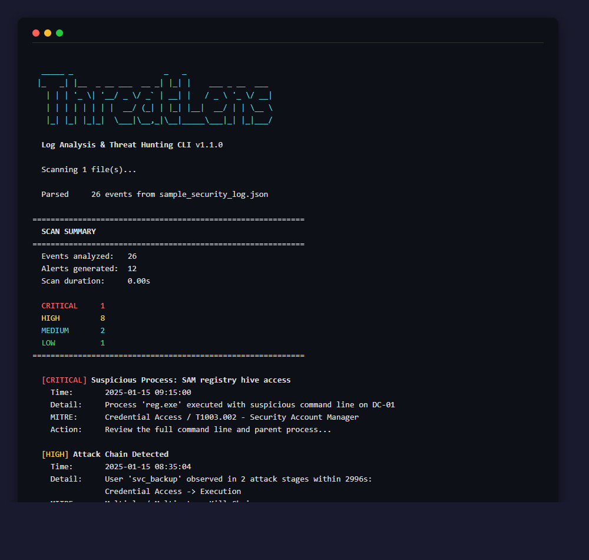
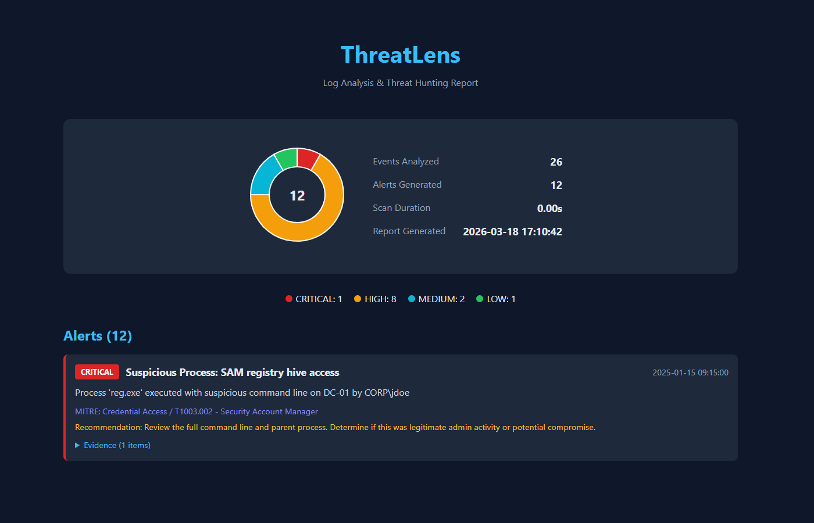
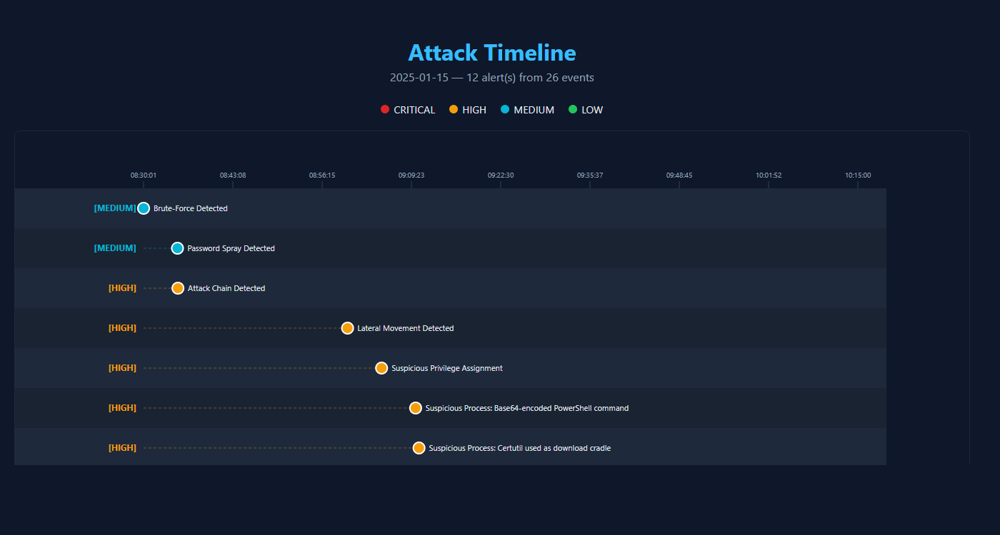

<p align="center">
  
  
  
  
  
  
  
</p>

<h1 align="center">ThreatLens</h1>

<p align="center">
  <b>Log Analysis & Threat Hunting CLI for Security Analysts</b><br>
  Parse EVTX, JSON, Syslog & CEF logs &mdash; run Sigma rules &mdash; detect multi-stage attacks &mdash; get actionable alerts mapped to MITRE ATT&CK.
</p>

---

## Why ThreatLens?

Security teams deal with thousands of log events daily. ThreatLens automates the first pass of triage &mdash; catching brute-force attacks, lateral movement, privilege escalation, suspicious process execution, and multi-stage kill chains &mdash; so analysts can focus on real investigation instead of scrolling through raw logs.

It runs entirely offline, requires no infrastructure, and produces structured output that feeds into existing SIEM workflows or stands alone as a report.

---

## Screenshots

<table>
  <tr>
    <td align="center"><b>Terminal Scan</b></td>
    <td align="center"><b>HTML Report</b></td>
    <td align="center"><b>Attack Timeline</b></td>
  </tr>
  <tr>
    <td></td>
    <td></td>
    <td></td>
  </tr>
</table>

---

## Quick Start

```bash
git clone https://github.com/TiltedLunar123/ThreatLens.git
cd ThreatLens

python -m venv .venv
source .venv/bin/activate        # Linux / macOS
.venv\Scripts\activate           # Windows

pip install -e ".[dev]"          # core + test dependencies
pip install -e ".[evtx]"         # optional: native EVTX parsing

threatlens scan sample_data/sample_security_log.json
```

> **Requirements:** Python 3.10+. The only runtime dependency is PyYAML. EVTX support (`python-evtx`) is optional.

---

## Features at a Glance

### Detections

| Module | What It Catches | MITRE |
|--------|----------------|-------|
| Brute-Force / Password Spray | Bursts of failed logons from one source; distinguishes targeted brute-force from credential spray | T1110 |
| Lateral Movement | Single account authenticating to multiple hosts rapidly (network logons, RDP) | T1021 |
| Privilege Escalation | Sensitive privilege assignments (SeDebugPrivilege, SeTcbPrivilege) to non-system accounts | T1134 |
| Suspicious Process Execution | LOLBins, encoded PowerShell, certutil download cradles, SAM dumping, service creation | T1059 |
| Attack Chain Correlation | Multi-stage kill chain linking credential access &rarr; priv-esc &rarr; lateral movement &rarr; execution | Multi-stage |

### Input Formats

| Format | Extensions | Notes |
|--------|-----------|-------|
| JSON / NDJSON | `.json` `.ndjson` `.jsonl` | Windows Event Log JSON exports, generic JSON logs |
| EVTX | `.evtx` | Native Windows Event Log &mdash; no manual export step needed |
| Syslog | `.log` `.syslog` | RFC 3164 and RFC 5424 with auto-detection |
| CEF | `.cef` | Common Event Format (ArcSight, Splunk, etc.) |

### Rule Engines

| Engine | Description |
|--------|------------|
| Built-in detections | 5 modules tunable via `rules/default_rules.yaml` |
| Custom YAML rules | Field matching with 12 operators, grouping, thresholds, and time windows |
| Sigma compatibility | Load community [Sigma rules](https://github.com/SigmaHQ/sigma) directly &mdash; selections, filters, conditions, field modifiers |

### Output Formats

| Output | Description |
|--------|------------|
| Terminal | Color-coded severity alerts with MITRE mapping and recommendations |
| JSON | Structured report for SIEM ingestion or automation |
| CSV | Spreadsheet-friendly export |
| HTML | Self-contained report with SVG donut chart and expandable evidence |
| Timeline | Interactive HTML attack timeline with hover tooltips |
| Elasticsearch | Push alerts to an ES index via the bulk API (stdlib only, no client dependency) |

---

## Usage

### Scanning

```bash
# Single file
threatlens scan logs/security.json

# Native EVTX
threatlens scan evidence/security.evtx

# Syslog
threatlens scan /var/log/auth.log --input-format syslog

# Directory (recursive, auto-detects formats)
threatlens scan /path/to/logs/ --recursive

# Only HIGH and CRITICAL
threatlens scan logs/ --min-severity high

# Verbose mode (show evidence per alert)
threatlens scan logs/ --verbose
```

### Reports & Export

```bash
threatlens scan logs/ -o report.json -f json
threatlens scan logs/ -o report.csv  -f csv
threatlens scan logs/ -o report.html -f html
threatlens scan logs/ --timeline timeline.html
```

### Custom & Sigma Rules

```bash
# Custom YAML rules
threatlens scan logs/ --custom-rules my_rules/

# Sigma rules
threatlens scan logs/ --sigma-rules sigma/rules/windows/

# Combine everything
threatlens scan logs/ --custom-rules my_rules/ --sigma-rules sigma/rules/ --min-severity medium
```

### Elasticsearch

```bash
threatlens scan logs/ --elastic-url http://localhost:9200

# Custom index + API key
threatlens scan logs/ --elastic-url https://es.internal:9200 \
  --elastic-index threatlens-2025 \
  --elastic-api-key YOUR_KEY
```

### Real-Time Tailing

```bash
# Tail a log file (like tail -f with detection)
threatlens follow /var/log/events.json

# Syslog with custom buffer
threatlens follow /var/log/auth.log --input-format syslog \
  --buffer-size 50 --flush-interval 3
```

### CI/CD Integration

```bash
# Exit code 2 if any HIGH+ alert fires — use in pipelines
threatlens scan logs/ --fail-on high

# Summary only, no color (clean for CI output)
threatlens scan logs/ --summary-only --no-color
```

### Allowlists

Suppress known-good alerts so they stop cluttering results:

```bash
threatlens scan logs/ --allowlist ops/allowlist.yaml
```

```yaml
allowlist:
  - rule_name: "Brute-Force"
    username: "svc_monitor"
    reason: "Service account — expected failed auths"
  - rule_name: "Privilege"
    computer: "DC-01"
    username: "SYSTEM"
  - source_ip: "10.0.1.100"
    severity: "low"
    reason: "Vulnerability scanner"
  - mitre_technique: "T1033"
    reason: "Noisy discovery rule — tuned out"
```

Suppressed alerts are tracked per-reason and printed as a summary at the end of the scan.

### Other Commands

```bash
threatlens rules                    # List built-in detection rules
python -m threatlens.cli scan ...   # Run without installing
```

---

## Example Output

```
  _____ _                    _   _
 |_   _| |__  _ __ ___  __ _| |_| |    ___ _ __  ___
   | | | '_ \| '__/ _ \/ _` | __| |   / _ \ '_ \/ __|
   | | | | | | | |  __/ (_| | |_| |__|  __/ | | \__ \
   |_| |_| |_|_|  \___|\__,_|\__|_____\___|_| |_|___/

  Log Analysis & Threat Hunting CLI v1.1.0

  Scanning 1 file(s)...
  Parsed     26 events from sample_security_log.json

============================================================
  SCAN SUMMARY
============================================================
  Events analyzed:   26
  Alerts generated:  11
  Scan duration:     0.00s

  CRITICAL     1
  HIGH         5
  MEDIUM       4
  LOW          1
============================================================

  [CRITICAL] Suspicious Process: SAM registry hive access
    Time:       2025-01-15 09:15:00
    Detail:     Process 'reg.exe' executed with suspicious command line on DC-01
    MITRE:      Execution / T1059 - Command and Scripting Interpreter
    Action:     Review the full command line and parent process...

  [HIGH] Brute-Force Detected
    Time:       2025-01-15 08:30:01
    Detail:     7 failed logon attempts from 10.0.1.50 targeting 1 account(s) within 300s
    MITRE:      Credential Access / T1110 - Brute Force
    Action:     Investigate source 10.0.1.50. Consider blocking the IP...

  [HIGH] Lateral Movement Detected
    Time:       2025-01-15 09:00:00
    Detail:     User 'svc_deploy' authenticated to 4 distinct hosts within 600s
    MITRE:      Lateral Movement / T1021 - Remote Services

  [HIGH] Suspicious Privilege Assignment
    Time:       2025-01-15 09:05:00
    Detail:     User 'jdoe' was assigned sensitive privileges: SeDebugPrivilege, SeTcbPrivilege
    MITRE:      Privilege Escalation / T1134 - Access Token Manipulation
```

---

## Writing Custom YAML Rules

Create detection rules without writing Python. Place `.yaml` files in a directory and load with `--custom-rules`.

```yaml
rules:
  - name: "After-Hours Logon"
    description: "Logon outside business hours"
    severity: medium
    mitre_tactic: "Initial Access"
    mitre_technique: "T1078 - Valid Accounts"
    conditions:
      - field: event_id
        operator: equals
        value: "4624"
    group_by: target_username
    threshold: 1
    recommendation: "Verify this logon was expected outside business hours"

  - name: "Mass File Access"
    description: "Single user accessing many files rapidly"
    severity: high
    conditions:
      - field: event_id
        operator: equals
        value: "4663"
    group_by: username
    threshold: 50
    window_seconds: 60
    recommendation: "Check for potential data exfiltration"
```

**Supported operators:** `equals`, `not_equals`, `contains`, `not_contains`, `startswith`, `endswith`, `regex`, `gt`, `lt`, `gte`, `lte`, `in`

---

## Sigma Rules

ThreatLens loads [Sigma rules](https://github.com/SigmaHQ/sigma) natively:

```bash
git clone https://github.com/SigmaHQ/sigma.git
threatlens scan logs/ --sigma-rules sigma/rules/windows/
```

**Supported Sigma features:**

- Selection blocks with field matching and wildcard (`*`) support
- Field modifiers: `|contains`, `|startswith`, `|endswith`, `|re`, `|all`
- Conditions: `selection`, `selection and not filter`, `1 of selection*`, `all of them`, compound `AND`/`OR`/`NOT`
- Logsource pre-filtering by category
- MITRE ATT&CK tag extraction from `tags` field
- Severity mapping from `level` field

The test suite validates against 7 Sigma rules covering OR conditions, AND NOT filters, `|contains|all`, `|endswith`, `|startswith`, and multi-selection patterns.

---

## Evaluation

Detection results from running ThreatLens against the included sample datasets:

### `sample_security_log.json` &mdash; 26 events (focused attack simulation)

| Severity | Count | Detections |
|----------|-------|------------|
| CRITICAL | 1 | SAM registry hive access |
| HIGH | 8 | Lateral movement, privilege escalation, encoded PowerShell, certutil download, account creation, scheduled task, service creation, attack chain |
| MEDIUM | 2 | Brute-force (7 failed logons), password spray (5 targets) |
| LOW | 1 | Privilege enumeration (whoami /priv) |

**12 alerts from 26 events.** All embedded attack activity detected with correct MITRE ATT&CK mapping. Attack chain correlator linked credential access to subsequent execution across a ~50-minute window.

### `mixed_enterprise_log.json` &mdash; 52 events (benign noise + embedded attack)

| Severity | Count | Detections |
|----------|-------|------------|
| CRITICAL | 1 | SAM registry hive access |
| HIGH | 9 | Brute-force, lateral movement, privilege escalation, encoded PowerShell, certutil download, scheduled task, service creation, 2 attack chains |
| MEDIUM | 0 | &mdash; |
| LOW | 0 | &mdash; |

**10 alerts from 52 events.** 30 benign events (routine logons, scheduled tasks, application logs) produced **zero false positives**. Two attack chains detected: `admin` (Credential Access &rarr; Lateral Movement) and `asmith` (Lateral Movement &rarr; Execution).

### Key Takeaways

- **Zero false positives** on benign activity in the mixed dataset
- **100% detection rate** on all embedded attack techniques
- **Attack chain correlation** links activity across kill chain phases
- All alerts include correct **MITRE ATT&CK** tactic and technique labels

---

## How It Works

```
  Log Files                     Detection Engines                  Output
 ┌──────────┐              ┌─────────────────────┐          ┌──────────────┐
 │ JSON     │─┐            │ Built-in Detections  │          │ Terminal     │
 │ EVTX     │ │  ┌──────┐  │ Custom YAML Rules    │  ┌────┐  │ JSON / CSV   │
 │ Syslog   │─┼─>│Parse │─>│ Sigma Compatibility  │─>│Rank│─>│ HTML Report  │
 │ CEF      │ │  └──────┘  │ Attack Chain Correlat.│  └────┘  │ Timeline     │
 │ (dir)    │─┘            └─────────────────────┘          │ Elasticsearch│
 └──────────┘                                               └──────────────┘
```

1. **Parse** &mdash; Logs are loaded from any supported format and normalized into a common `LogEvent` model. Format is auto-detected from the file extension or forced with `--input-format`.
2. **Detect** &mdash; Built-in detections, custom YAML rules, and Sigma rules analyze the event stream using time-window grouping, field correlation, and regex matching.
3. **Report** &mdash; Alerts are ranked by severity, mapped to MITRE ATT&CK, and output with actionable recommendations.

---

## Supported Log Formats

### JSON / NDJSON

Standard Windows Event Log JSON exports or any JSON with `EventID`, `TimeCreated`, and `EventData` fields:

```json
{
  "TimeCreated": "2025-01-15T08:30:01Z",
  "EventID": 4625,
  "Computer": "WS-PC01",
  "EventData": {
    "TargetUserName": "admin",
    "IpAddress": "10.0.1.50",
    "LogonType": 3
  }
}
```

**Export logs with PowerShell:**

```powershell
Get-WinEvent -LogName Security -MaxEvents 1000 |
  Select-Object TimeCreated, Id, MachineName, Message |
  ConvertTo-Json | Out-File security_events.json
```

### EVTX (Native)

```bash
threatlens scan C:\Windows\System32\winevt\Logs\Security.evtx
```

> Requires the optional `python-evtx` package: `pip install -e ".[evtx]"`

### Syslog (RFC 3164 / 5424)

```
<34>Jan 15 08:30:01 server01 sshd[1234]: Failed password for admin from 10.0.1.50 port 22 ssh2
```

### CEF (Common Event Format)

```
CEF:0|Security|IDS|1.0|100|Intrusion Detected|7|src=10.0.1.50 duser=admin dhost=server01
```

---

## Project Structure

```
ThreatLens/
├── threatlens/
│   ├── __init__.py                  # Package metadata & version
│   ├── cli.py                       # CLI argument parsing & command routing
│   ├── models.py                    # LogEvent, Alert, Severity data models
│   ├── report.py                    # Terminal output, JSON/CSV export
│   ├── utils.py                     # Helpers (colors, time grouping, tables)
│   ├── parsers/
│   │   ├── __init__.py              # Unified parser interface (auto-detect)
│   │   ├── json_parser.py           # JSON / NDJSON log parsing
│   │   ├── evtx_parser.py           # Native Windows EVTX parsing (optional)
│   │   └── syslog_parser.py         # Syslog (RFC 3164/5424) & CEF parsing
│   ├── rules/
│   │   ├── __init__.py              # Rule engine exports
│   │   ├── yaml_rules.py            # Custom YAML rule engine (12 operators)
│   │   └── sigma_loader.py          # Sigma rule compatibility layer
│   ├── outputs/
│   │   ├── __init__.py              # Output module exports
│   │   ├── html_report.py           # HTML report with SVG severity charts
│   │   ├── timeline.py              # Interactive attack timeline visualization
│   │   └── elasticsearch.py         # Elasticsearch bulk API connector (stdlib)
│   └── detections/
│       ├── __init__.py              # Detection registry
│       ├── base.py                  # Abstract DetectionRule base class
│       ├── attack_chain.py          # Multi-stage kill chain correlation
│       ├── brute_force.py           # Failed logon burst & spray detection
│       ├── lateral_movement.py      # Multi-host auth pattern detection
│       ├── privilege_escalation.py  # Sensitive privilege monitoring
│       └── suspicious_process.py    # LOLBin & command-line analysis
├── rules/
│   └── default_rules.yaml           # Tunable detection thresholds
├── sample_data/
│   ├── sample_security_log.json     # 26 events — focused attack simulation
│   └── mixed_enterprise_log.json    # 52 events — benign noise + embedded attack
├── tests/
│   ├── conftest.py                  # Shared fixtures & event helpers
│   ├── test_cli.py                  # CLI argument parsing & scan paths
│   ├── test_detections.py           # Detection module unit tests
│   ├── test_evtx_parser.py          # EVTX parser edge cases
│   ├── test_outputs.py              # HTML, timeline, Elasticsearch tests
│   ├── test_parsers.py              # Parser & format detection tests
│   ├── test_report.py               # Report generation & export tests
│   ├── test_rules.py                # YAML rules, Sigma matching & corpus validation
│   ├── test_utils.py                # Utility function tests
│   └── sigma_samples/               # 7 Sigma rules for integration tests
├── docs/
│   └── images/                      # README screenshots
├── pyproject.toml                   # Build config, dependencies, extras
├── requirements.txt                 # Runtime dependency (pyyaml)
├── .gitignore
├── LICENSE
└── README.md
```

---

## Exit Codes

| Code | Meaning |
|------|---------|
| `0`  | Scan completed &mdash; no alerts at or above the `--fail-on` threshold |
| `1`  | Error (bad input, missing files, parse failure) |
| `2`  | Scan completed &mdash; alerts found at or above the `--fail-on` threshold |

Use exit codes in CI pipelines to gate deployments or trigger incident workflows.

---

## Running Tests

```bash
pip install -e ".[dev]"
pytest tests/ -v
```

Run with coverage:

```bash
pytest tests/ --cov=threatlens --cov-report=term-missing
```

The test suite covers all modules across 8 test files:

| File | Coverage |
|------|----------|
| `test_parsers.py` | JSON, syslog, CEF, EVTX, format detection, routing |
| `test_detections.py` | Brute-force, lateral movement, priv-esc, suspicious process, attack chain |
| `test_rules.py` | Custom YAML rules, Sigma matching, 7-rule corpus validation |
| `test_outputs.py` | HTML report, timeline, Elasticsearch bulk API |
| `test_cli.py` | Argument parsing, file collection, scan/follow paths |
| `test_report.py` | Terminal output, JSON/CSV export |
| `test_evtx_parser.py` | XML-to-dict, record parsing, mocked load/stream |
| `test_utils.py` | Color helpers, time grouping, table formatting |

---

## Security & Ethics

ThreatLens is a **defensive-only** tool. It analyzes logs that already exist on systems you own or are authorized to audit. It does **not**:

- Access remote systems or networks
- Capture or sniff network traffic
- Exploit any vulnerabilities
- Generate attack traffic or payloads

Use this tool only on systems and logs you have explicit authorization to analyze.

---

## Author

**Jude Hilgendorf** &mdash; [GitHub](https://github.com/TiltedLunar123)

## License

MIT License. See [LICENSE](LICENSE) for details.
